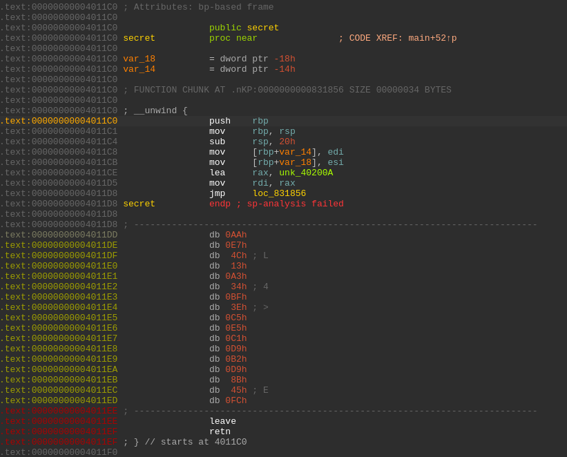
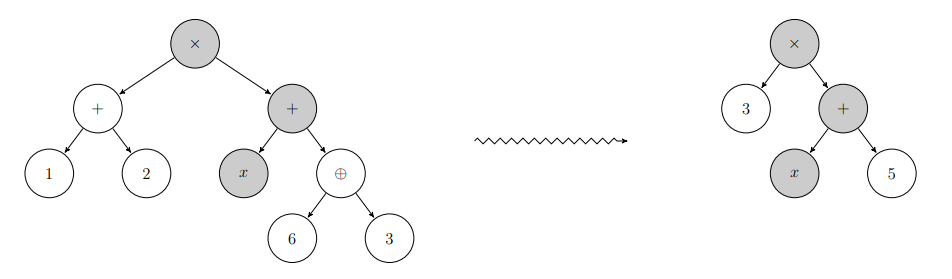
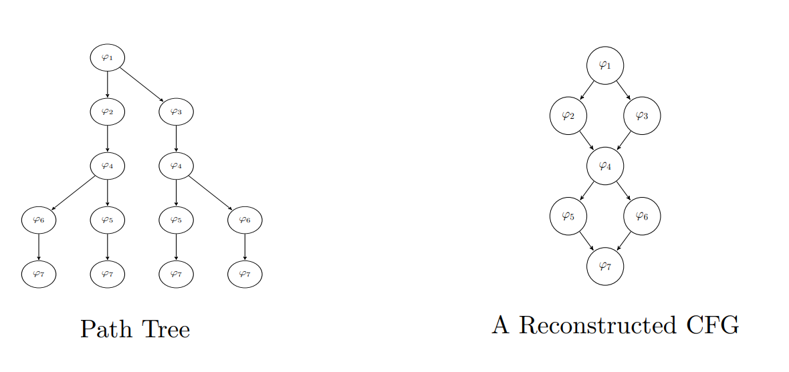

<h1 align="center">VMProtect Devirtualization</h1>
<p align="center">
  An <b>experimental</b> dynamic approach to devirtualize pure functions protected by <b>VMProtect 3.x</b>
</p>

<p>&nbsp;</p>
<p>&nbsp;</p>

* [TL;DR](#tldr)
* [Introduction](#introduction)
* [The approach](#the-approach)
    * [Example 1: A simple bitwise operation protected](#example-1-a-simple-bitwise-operation-protected)
    * [Example 2: A MBA operation protected](#example-2-a-mba-operation-protected)
    * [Example 3: More than one basic block](#example-3-more-than-one-basic-block)
* [Conclusion and limitations](#conclusion-and-limitations)
* [References](#references)

<p>&nbsp;</p>
<p>&nbsp;</p>

# TL;DR

I am sharing some notes about a dynamic approach to devirtualize pure functions protected by VMProtect.
This approach has shown very good results if the virtualized function only contains one basic block
(regardless of its size). This is a common scenario when binaries protect arithmetic operations. However,
this approach is a bit more experimental when the target function contains more than one basic block.
Nevertheless, we managed to devirtualize and reconstruct the binary code from samples that contain 2 basic
blocks which suggests that it is possible to fully devirtualize small functions dynamically.


# Introduction

[VMProtect](https://vmpsoft.com) is a software protection that protects code by running it through a virtual
machine with non-standard architecture. This protection is a great playground for asm lovers
[0, 1, 2, 3, 4, 5, 6, 11]. Also, there are already numerous tools that attack this protection [7, 8, 9, 12, 13].
In 2016 we took a look at the [Tigress](https://github.com/JonathanSalwan/Tigress_protection/) software
protection solution and managed to defeat its virtualization using symbolic execution and LLVM. This approach
has been presented at DIMVA 2018 [10] and I wanted to test it on VMProtect. Note that there is no
magic solution that works on every binaries, there are always tradeoffs depending on the target and your goals.
This modest contribution aims to provide an example of a dynamic attack against *pure functions* that are virtualized
by VMProtect. The main advantage of a dynamic attack is that it defeats by design some VMProtect's static protections
like self modifying code, key and operands encryption etc.

We consider a pure function a function with a finite number of paths and that does not have side effects.
There can be several inputs but only one output. Below is an example of a pure function:

```cpp
int secret(int x, int y) {
  int r = x ^ y;
  return r;
}
```

# The approach

We rely on the key intuition that an obfuscated trace T' (from the obfuscated code P') combines original
instructions from the original code P (the trace T corresponding to T' in the original code) and
instructions of the virtual machine VM such that T' = T + VM(T). If we are able to distinguish between
these two subsequences of instructions T and VM(T), we then are able to reconstruct one path of the
original program P from a trace T'. By repeating this operation to cover all paths of the virtualized
program, we will be able to reconstruct the original program P. In our practical example, the original
code has a finite number of executable paths, which is the case in many situations involving intellectual
property protection. To do so, we proceed with the following steps:

1. Identify the virtualized function and its arguments
2. Generate a VMProtect trace of the target
3. Replay the VMP trace and construct symbolic expressions to obtain the relation between inputs and output
4. Apply optimizations on symbolic expressions to avoid as much as possible instructions from the VM
5. Lift our symbolic representation to the LLVM-IR to build a new unprotected version of the target

## Example 1: A simple bitwise operation

Let's take as a first example the following function: it takes two inputs and returns `x ^ y` which is protected by VMProtect.

```cpp
int secret(int x, int y) {
  VMProtectBegin("secret");
  int r = x ^ y;
  VMProtectEnd();
  return r;
}
```

We start by identifying where functions are using VMProtect and how many arguments they have. For our example we may have something like below:

<p align="center">
  
</p>

Just by reading the code we know that the function starts at the address `0x4011c0`, have two 32-bit arguments (`edi` and `esi`)
and returns at `0x4011ef`. That's all the reverse-engineering we need. Next parts will be automatic. Now we
have to generate an trace execution of this virtualized function. To do so we use a [Pintool](pin/source/tools/VMP_Trace/VMP_Trace.cpp).
It only needs a `start` and an `end` address (for our example, `0x4011c0` and `0x4011ef`) which represents the range
of the instrumentation. Note that any kind of DBI or emulator could do this job.

```
$ ./pin/pin -t ./pin/source/tools/VMP_Trace/obj-intel64/VMP_Trace.so -start 4198848 -end 4198895 -- ./vmp_binaries/binaries/sample2.vmp.bin 1 2 &> ./vmp_traces/sample2.vmp.trace
```

You can see the result [here](vmp_traces/sample2.vmp.trace). The trace format uses three kind of operations: `mr`, `r` and `i`.
`mr` is a memory read access done by the instruction `i`, and `r` are the CPU registers. For example:

```
mr:0x7ffda459d718:8:0x227db4f8
r:0x40200a:0x0:0x7ffda459f571:0x2:0x40200a:0x0:0x0:0x7ffda459d688:0x0:0x0:0x7feee9b80ac0:0x7feee9b8000f:0xad1c3e:0x0:0x0:0x0
i:0x89173e:8:488BB42490000000
```

We have a memory read that loads an `8` bytes constant `0x227db4f8` from the address `0x7ffda459d718`.
The instruction is executed at the address `0x89173e` and its 8-bytes long opcode is `488BB42490000000` which is a
[`mov rsi, qword ptr [rsp + 0x90]`](http://shell-storm.org/online/Online-Assembler-and-Disassembler/?opcodes=488BB42490000000&arch=x86-64&endianness=little&dis_with_addr=True&dis_with_raw=True&dis_with_ins=True#disassembly).
The register state before the execution is the following:

```python
(1) RAX = 0x40200a          (9)  R8  = 0
(2) RBX = 0                 (10) R9  = 0
(3) RCX = 0x7ffda459f571    (11) R10 = 0x7feee9b80ac0
(4) RDX = 0x2               (12) R11 = 0x7feee9b8000f
(5) RDI = 0x40200a          (13) R12 = 0xad1c3e
(6) RSI = 0                 (14) R13 = 0
(7) RBP = 0                 (15) R14 = 0
(8) RSP = 0x7ffda459d688    (16) R15 = 0
```

Once the VMP trace has been generated, we replay it using the [attack_vmp.py](attack_vmp.py) script. This script uses
[Triton](https://github.com/jonathansalwan/Triton) to build the path predicate of the trace. Note that all expressions which
involve symbolic variables (inputs of the function) are kept symbolic while all non related input expressions are concretized. In
other words, our symbolic expressions do not contain any operation related to the virtual machine (the machinery
itself does not depend on the user) but only operations related to the original program.

For example, below is an example of a concretization. On the left we have an AST that contains subexpressions which do not involve
symbolic variable (`1 + 2` and `6 ^ 3`). So these branches are concretized and replaced by constants `3` and `5` which leads to
the AST on the right. **This is how we devirtualize code.**

<p align="center">
  
</p>

**A note on formula-level backward slicing**: As it is common in symbolic execution, the symbolic representation is first
computed in a forward manner along the path, then all logical operations and definitions affecting neither the final result
nor the followed path are removed from the symbolic expression (formula slicing, a.k.a. formula pruning). This turns out to
perform on the formula the equivalent of a backward slicing code analysis from the program output. Thus, at the return of the
`secret` function, we have an expression of the relation between the inputs and the output without the instructions of VMProtect.

The `./attack_vmp.py` script takes as parameters the trace file and the size of symbolic variables. Remember, it was `edi` and
`esi`, so they are 4 bytes long. The result of the script is the following:

```
$ ./attack_vmp.py --trace1 ./vmp_traces/sample2.vmp.trace --symsize 4
[+] Replaying the VMP trace
[+] Symbolize inputs
[+] Instruction executed: 12462
[+] Emulation done
[+] Return value: 0x3
[+] Devirt expr: (bvor (bvnot (bvor (bvnot (bvnot x)) (bvnot y))) (bvnot (bvor (bvnot x) (bvnot (bvand (bvnot y) (bvnot y))))))
[+] Synth expr: (bvxor x y)

[+] LLVM IR ==============================

; ModuleID = 'tritonModule'
source_filename = "tritonModule"

define i32 @__triton(i32 %SymVar_0, i32 %SymVar_1) {
entry:
  %0 = xor i32 %SymVar_0, %SymVar_1
  ret i32 %0
}

[+] EOF LLVM IR ==============================
```

As we can see, the devirtualized expression returned by the `secret` function is pretty concise and does not contain instructions from
the virtual machine.

```smt
(bvor
    (bvnot (bvor
             (bvnot (bvnot x))
             (bvnot y)
           )
    )
    (bvnot (bvor
             (bvnot x)
             (bvnot (bvand
                      (bvnot y)
                      (bvnot y)
                    )
             )
           )
    )
)
```

However, we did not manage to recover the original expression which was a simple `XOR` operation. It looks like the `XOR` has been
translated to bitwise operations. Luckily, we recently released new features in the Triton project which are
a [synthesizer](https://github.com/JonathanSalwan/Triton/issues/1074) and a lifter to
[LLVM-IR](https://github.com/JonathanSalwan/Triton/issues/1078). Thus, we can synthesize the expression which gives us the expression
`(bvxor x y)`. It's a good win and now we can go further by lifting this expression to LLVM-IR and then compile a new devirtualized
binary code.


## Example 2: A MBA operation protected

Ok, now let's take a look at another example which tries to hide an MBA operation. The original source code is the following:

```cpp
// This function is an MBA that computes: (x ^ 92) + y
// We will protect this MBA with VMProtect and see if we can recover "(x ^ 92) + y"
char secret(char x, char y) {
  VMProtectBegin("secret");
  int a = 229 * x + 247;
  int b = 237 * a + 214 + ((38 * a + 85) & 254);
  int c = (b + ((-(2 * b) + 255) & 254)) * 3 + 77;
  int d = ((86 * c + 36) & 70) * 75 + 231 * c + 118;
  int e = ((58 * d + 175) & 244) + 99 * d + 46;
  int f = (e & 148);
  int g = (f - (e & 255) + f) * 103 + 13;
  int r = (237 * (45 * g + (174 * g | 34) * 229 + 194 - 247) & 255) + y;
  VMProtectEnd();
  return r;
}
```

Like with the first example, we have to identify where this function starts and ends and generate a VMP trace.

```
$ ./pin/pin -t ./pin/source/tools/VMP_Trace/obj-intel64/VMP_Trace.so -start 4198857 -end 4199140 -- ./vmp_binaries/binaries/sample3.vmp.bin 1 2 &> ./vmp_traces/sample3.vmp.trace
```

Once the [VMP trace](vmp_traces/sample3.vmp.trace) is generated, let's run the `./attack_vmp.py` script.

```
$ ./attack_vmp.py --trace1 ./vmp_traces/sample3.vmp.trace --symsize 1
[+] Replaying the VMP trace
[+] Symbolize inputs
[+] A potential symbolic jump found on CF flag: 0x821dac: popfq - Model: {0: x:32 = 0xa3, 1: y:32 = 0xff}
[+] A potential symbolic jump found on CF flag: 0x87f437: popfq - Model: {0: x:32 = 0xa3, 1: y:32 = 0xff}
[+] Instruction executed: 25085
[+] Emulation done
[+] Return value: 0x5f
[+] Devirt expr: In: (bvadd (bvadd (bvshl (bvadd (_ bv1 32) (bvnot (bvlshr (concat (_ bv0 8) (_ bv0 8) ((_ extract 15 8)  ...
[+] Synth expr: In: (bvadd (bvadd (bvshl (bvadd (_ bv1 32) (bvnot (bvlshr (concat (_ bv0 8) (_ bv0 8) ((_ extract 15 8)  ...

[+] LLVM IR ==============================

; ModuleID = 'tritonModule'
source_filename = "tritonModule"

define i32 @__triton(i8 %SymVar_0, i8 %SymVar_1) {
entry:
  %0 = xor i8 %SymVar_0, 92
  %1 = and i8 %SymVar_0, 0
  %2 = zext i8 %1 to i32
  %3 = or i32 0, %2
  %4 = shl i32 %3, 8
  %5 = zext i8 %0 to i32
  %6 = or i32 %4, %5
  %7 = and i8 %SymVar_1, 0
  %8 = zext i8 %7 to i32
  %9 = or i32 0, %8
  %10 = shl i32 %9, 8
  %11 = zext i8 %SymVar_1 to i32
  %12 = or i32 %10, %11
  %13 = zext i8 %7 to i32
  %14 = or i32 0, %13
  %15 = shl i32 %14, 8
  %16 = zext i8 %SymVar_1 to i32
  %17 = or i32 %15, %16
  %18 = lshr i32 %17, 7
  %19 = xor i32 %18, -1
  %20 = add i32 1, %19
  %21 = shl i32 %20, 8
  %22 = add i32 %21, %12
  %23 = add i32 %22, %6
  ret i32 %23
}

[+] EOF LLVM IR ==============================
```

The result is pretty interesting for several reasons. First, we successfully managed to avoid as much as possible
instructions from the virtual machine as we went from 25085 instructions executed to 25 LLVM instructions. However,
we did not manage to get a good synthesized version of the output (yes, I know, we are going further than just doing
devirtualization). The advantage of lifting our symbolic expressions to LLVM-IR is that we can fully benefit from LLVM's
optimization pipeline. Let's do this:

```llvm
$ opt -S -O3 ./devirt/sample3.ll
; ModuleID = 'devirt/sample3.ll'
source_filename = "tritonModule"

; Function Attrs: mustprogress nofree norecurse nosync nounwind readnone willreturn
define i32 @__triton(i8 %SymVar_0, i8 %SymVar_1) local_unnamed_addr #0 {
entry:
  %0 = xor i8 %SymVar_0, 92
  %1 = zext i8 %0 to i32
  %2 = zext i8 %SymVar_1 to i32
  %3 = shl nuw nsw i32 %2, 1
  %4 = and i32 %3, 256
  %5 = add nuw nsw i32 %1, %2
  %6 = sub nsw i32 %5, %4
  ret i32 %6
}
```

Using LLVM optimizations we managed to remove noise from our devirtualized output and thus break the MBA.
We can see the `XOR` operation with its constant (`%0 = xor i8 %SymVar_0, 92`) and the `+ y` (`%6 = add nsw i32 %5, %1`).
Instructions between are just dealing with the sign. To summarize this example, we fully devirtualized the `secret`
function using the `attack_vmp.py` script and then we fully broke the MBA using LLVM optimizations.

## Example 3: More than one basic block

We got very good results if the `secret` function only contains one basic block regardless of its size. So at this point
we are able to devirtualize one path. To reconstruct the whole function behavior, we have to successively devirtualize
reachable paths. To do so, we have to perform a path coverage on user-dependent branches. At the end, we get as a result
a path tree which represents the different paths of the original function. Path tree is obtained by introducing
if-then-else construction from two traces T1 and T2 with a same prefix followed by a condition C in T1 and a not(C)
in T2. Once a path tree is built, we can let LLVM generate a CFG.

<p align="center">
  
</p>

With the Tigress software protection, virtual jumps were implemented with real `jcc` instructions which allowed
us to quickly identify jump condition. However, things are getting more complex when virtual jumps are involved
with VMProtect as it does not uses `jcc` instructions for jumping to another virtual block. We had to define
markers on a dynamic trace to spot the condition involved in a user-dependent branch. This is the experimental part
of this attack as markers are not really accurate but worked for our samples.

Ok, let's consider the following sample:

```cpp
int secret(int x, int y) {
  VMProtectBegin("secret");
  int r = 0;
  if (x + y == 1001)
    r = x + 1;
  else
    r = y - 1;
  VMProtectEnd();
  return r;
}
```

Like with the first examples we have to generate and analyze the trace.

```
$./pin/pin -t ./pin/source/tools/VMP_Trace/obj-intel64/VMP_Trace.so -start 4198848 -end 4198928 -- ./vmp_binaries/binaries/sample5.vmp.bin 1 2 &> ./vmp_traces/sample5.vmp.trace.1

$ ./attack_vmp.py --trace1 ./vmp_traces/sample5.vmp.trace.1 --symsize 4
[+] Replaying the VMP trace
[+] Symbolize inputs
[+] A potential symbolic jump found of AF flag: 0x80d905: cmp r11b, dl - Model: {0: x:32 = 0x0, 1: y:32 = 0x3e9}
[+] Instruction executed: 16164
[+] Emulation done
[+] Return value: 0x4
[+] Devirt expr: (bvnot (bvadd (bvand (bvnot y) (bvnot y)) (_ bv1 32)))
[+] Synth expr: (bvadd y (_ bv4294967295 32))

[+] LLVM IR ==============================

; ModuleID = 'tritonModule'
source_filename = "tritonModule"

define i32 @__triton(i32 %SymVar_1) {
entry:
  %0 = add i32 %SymVar_1, -1
  ret i32 %0
}

[+] EOF LLVM IR ==============================
```

The script tells us that there may be a potential symbolic jump found on the `AF` flag at address `0x80d905`.
It also provides a new model (using symbolic execution) which should take the other path. So let's generate a
second trace using this model (if you take a look to the model, it is correct regarding our source code).

```
$ ./pin/pin -t ./pin/source/tools/VMP_Trace/obj-intel64/VMP_Trace.so -start 4198848 -end 4198928 -- ./vmp_binaries/binaries/sample5.vmp.bin 0 1001 &> ./vmp_traces/sample5.vmp.trace.2
```

Once the second trace is generated, we have to provide those two traces to the `attack_vmp.py` script so that it
can merge them and create a path tree. We have extra options to define where the condition is located
and on what flag (AF flag at `0x80d905`).

```
$ ./attack_vmp.py --trace1 ./vmp_traces/sample5.vmp.trace.1 --symsize 4 --trace2 ././vmp_traces/sample5.vmp.trace.2 --vbraddr 0x80d905 --vbrflag af
[+] Replaying the VMP trace
[+] Symbolize inputs
[+] A potential symbolic jump found of AF flag: 0x80d905: cmp r11b, dl - Model: {0: x:32 = 0x0, 1: y:32 = 0x3e9}
[+] Instruction executed: 16164
[+] Emulation done
[+] A second trace has been provided
[+] Replaying the VMP trace
[+] Symbolize inputs
[+] Instruction executed: 15758
[+] Emulation done
[+] Merging expressions from trace1 and trace2
[+] Return value: 0x3e9
[+] Devirt expr: In: (ite (= (ite (= (_ bv16 8) (bvand (_ bv16 8) (bvxor (bvsub (_ bv80 8) ((_ extract 7 0) (bvadd (bvlsh ...
[+] Synth expr: In: (ite (= (ite (= (_ bv16 8) (bvand (_ bv16 8) (bvxor (bvsub (_ bv80 8) ((_ extract 7 0) (bvadd (bvlsh ...

[+] LLVM IR ==============================

; ModuleID = 'tritonModule'
source_filename = "tritonModule"

define i32 @__triton(i32 %SymVar_0, i32 %SymVar_1) {
entry:
  %0 = add i32 %SymVar_1, -1
  %1 = add i32 %SymVar_0, 1
  %2 = add i32 %SymVar_1, %SymVar_0
  %3 = xor i32 %2, -1
  %4 = xor i32 %2, -1
  %5 = and i32 %4, %3
  %6 = xor i32 %5, 1001
  %7 = add i32 %5, 1001
  %8 = xor i32 %5, 1001
  %9 = xor i32 %8, %7
  %10 = and i32 %9, %6
  [... skip ...]
  %469 = add i64 %468, 140737488347280
  %470 = trunc i64 %469 to i8
  %471 = xor i8 80, %470
  %472 = sub i8 80, %470
  %473 = xor i8 %472, %471
  %474 = and i8 16, %473
  %475 = icmp eq i8 16, %474
  %476 = select i1 %475, i1 true, i1 false
  %477 = icmp eq i1 %476, false
  %478 = select i1 %477, i32 %1, i32 %0
  ret i32 %478
}

[+] EOF LLVM IR ==============================
```

At this step we devirtualized the two traces and merged them into `if-then-else` expressions.
After lifting the expression to LLVM-IR we get a CFG with only 480 LLVM instruction which is
already a good win comparing to the thousands of instructions executed by the virtual machine.
But we can do better if we use LLVM optimizations:

```llvm
$ opt -S -O3 ./devirt/sample5.ll
; ModuleID = './devirt/sample5.ll'
source_filename = "tritonModule"

; Function Attrs: mustprogress nofree norecurse nosync nounwind readnone willreturn
define i32 @__triton(i32 %SymVar_0, i32 %SymVar_1) local_unnamed_addr #0 {
entry:
  %0 = add i32 %SymVar_0, 1
  %1 = add i32 %SymVar_1, -1
  %2 = add i32 %SymVar_1, %SymVar_0
  %.not = icmp eq i32 %2, 1001
  %3 = select i1 %.not, i32 %0, i32 %1
  ret i32 %3
}

attributes #0 = { mustprogress nofree norecurse nosync nounwind readnone willreturn }
```

Woot, we recovered the original behavior of the `secret` function!

# Conclusion and limitations

While the approach showed very good results for functions that contain one path, the main limitation
of the method is that it is mostly geared towards programs with a small number of paths due to the way
VMProtect does virtual jumps. In case of a too high number of paths, parts of the original code may be
lost, yielding an incomplete recovery. Note that we are considering executable paths rather than syntactic
paths in the CFG. Hash and other cryptographic functions often have only very few paths - only one path
in the case of timing-attack resistant implementations.

Also our current implementation is limited to programs without any user-dependent
memory access. This limitation can be partly removed by using a more symbolic handling of memory accesses in DSE.

Note also that while bounded loops and non-recursive function calls are handled, they are currently recovered
as inlined or unrolled code, causing a potential blowup in size of the devirtualized code. It would be interesting
to have a post processing step trying to rebuild these high-level abstractions.

To conclude, please note that I'm not aiming to provide any kind of magic method, those are just some notes about
a dynamic attack against very specific cases protected by VMProtect =).

If you want to take a deeper look, check out those resources:

* [The Pintool to generate trace](pin/source/tools/VMP_Trace/VMP_Trace.cpp)
* [Script to analyze a VMP trace](attack_vmp.py)
* [Samples source code](vmp_binaries/samples-source)
* [Original and protected binaries](vmp_binaries/binaries)
* [VMP traces](vmp_traces)
* [Devirtualized results](devirt)

Last but not least, special thanks to my mate [@0vercl0k](https://twitter.com/0vercl0k) for proofreading and edits :rocket:

# References

```
[00] https://www.usenix.org/legacy/event/woot09/tech/full_papers/rolles.pdf
[01] https://secret.club/2021/09/08/vmprotect-llvm-lifting-1.html
[02] https://secret.club/2021/09/08/vmprotect-llvm-lifting-2.html
[03] https://secret.club/2021/09/08/vmprotect-llvm-lifting-3.html
[04] https://back.engineering/17/05/2021/
[05] https://back.engineering/21/06/2021/
[06] https://www.mitchellzakocs.com/blog/vmprotect3
[07] https://github.com/can1357/NoVmp
[08] https://github.com/archercreat/vmpfix
[09] https://github.com/void-stack/VMUnprotect
[10] https://github.com/JonathanSalwan/Triton/blob/master/publications/DIMVA2018-slide-deobfuscation-salwan-bardin-potet.pdf
[11] https://whereisr0da.github.io/blog/posts/2021-02-16-vmp-3/
[12] https://github.com/pgarba/UniTaint
[13] https://github.com/mrexodia/VMProtectTest
```

